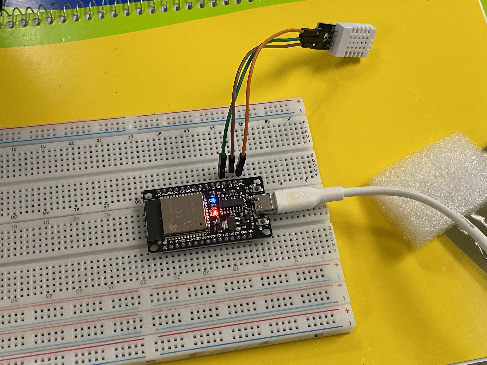
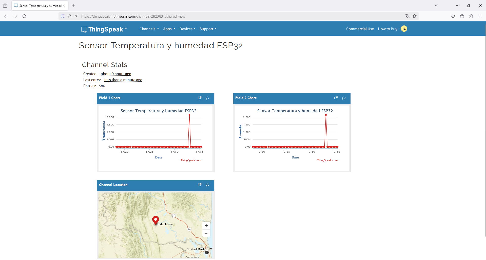

# Estación Meteorológica con ESP32, DHT22 y ThingSpeak

Este proyecto utiliza un ESP32 junto con un sensor DHT22 para medir temperatura y humedad. Los datos se envían a la plataforma **ThingSpeak** para su almacenamiento y visualización en la nube.

## Características del Proyecto
- Conexión WiFi con ESP32.
- Lectura de temperatura y humedad con DHT22.
- Envío de datos a **ThingSpeak** mediante API.
- Manejo de errores en la lectura del sensor.

## Componentes Necesarios
- **ESP32**.
- **Sensor DHT22** (para medir temperatura y humedad).
- **Conexión a Internet** (mediante WiFi).
- **Cuenta en ThingSpeak** (para almacenar y visualizar datos).

## Conexión del Hardware
| Componente | Pin en ESP32 |
|------------|-------------|
| DHT22 Data | GPIO 32     |
| VCC        | 3.3V        |
| GND        | GND         |

## Configuración en ThingSpeak
1. Crea una cuenta en **ThingSpeak** (https://thingspeak.com/).
2. Crea un nuevo canal y anota su **Channel ID**.
3. Obtén la **Write API Key**.
4. Sustituye los valores en el código:
   ```cpp
   const char* ssid = "SSID_DE_TU_WIFI";
   const char* password = "CONTRASEÑA_DE_TU_WIFI";
   unsigned long channelID = TU_CHANNEL_ID;
   const char* WriteAPIKey = "TU_WRITE_API_KEY";
   ```

## Instalación y Uso
1. Clona este repositorio o copia el código en el **IDE de Arduino**.
2. Instala las siguientes bibliotecas desde el **Gestor de Librerías**:
   - `DHT sensor library` de Adafruit.
   - `WiFi` (incluida en el ESP32 Core).
   - `ThingSpeak`.
3. Conecta el ESP32 a la computadora y selecciona la placa correcta en el IDE.
4. Compila y sube el código al ESP32.
5. Abre el monitor serie para verificar la conexión WiFi y el envío de datos.

## Funcionamiento del Código
- Se conecta a WiFi.
- Inicializa el sensor DHT22.
- Lee temperatura y humedad.
- Envía los datos a **ThingSpeak** cada 16 segundos.
- Si la lectura falla, intenta nuevamente hasta obtener datos válidos.

## Visualización de Datos
Una vez que los datos sean enviados a ThingSpeak, puedes visualizarlos en **gráficos en tiempo real** dentro de tu canal.

## Capturas de evidencia



